# b2c-tools

[](https://github.com/SalesforceCommerceCloud/b2c-tools/actions/workflows/test.yaml)

`b2c-tools` is a CLI tool and library for data migrations, import/export, scripting and other tasks with SFCC B2C instances. It is intended to be complimentary to other tools such as `sfcc-ci` for development and CI/CD scenarios.

## Features

- A CLI and [extendable](./docs/EXTENDING.md) library that understands most common B2C configuration sources including [multiple instances](#configuration)
- A data migration system for managing imports and migration "scripts" to B2C instances
    - see [Migrations](#Migrations) for usage and [docs/MIGRATIONS](docs/MIGRATIONS.md) for details
- running [migration scripts](./docs/MIGRATIONS.md#migration-scripts) for automation of one-off or regular tasks
- [Importing](#import-run) both impex archives (without uploading or zipping contents) and migration scripts
- Interactive [site export](#site-export) without logging into business manager
- Page Designer [page export](#page-export) with sub-components and static asset download
- [Extendable CLI](./docs/EXTENDING.md) and [API](./docs/API.md) for building new command line interfaces and tools
- Misc tools for syncing cartridges, viewing logs, etc...

## Installation

Since `b2c-tools` is a private package on github's registry you must configure a scoped registry in your project or 
user `.npmrc` file and login with a github [personal access token](https://docs.github.com/en/authentication/keeping-your-account-and-data-secure/creating-a-personal-access-token). For example:

```
// ~/.npmrc
//npm.pkg.github.com/:_authToken=ghp_ABC1234
@SalesforceCommerceCloud:registry=https://npm.pkg.github.com
```

See [Creating a Personal Access Token](https://docs.github.com/en/authentication/keeping-your-account-and-data-secure/creating-a-personal-access-token). 
The access token will require `read:packages` permissions. 

* (You can also see [Authenticating with a personal access token](https://docs.github.com/en/packages/working-with-a-github-packages-registry/working-with-the-npm-registry#authenticating-with-a-personal-access-token) and [Installing a Package](https://docs.github.com/en/packages/working-with-a-github-packages-registry/working-with-the-npm-registry#installing-a-package) from the github docs for more info.)

You can then install the scoped package globally (or as a project dependency):

```shell
npm install -g @SalesforceCommerceCloud/b2c-tools
b2c-tools --help
```

You can also install directly via github or via the package archive: https://github.com/SalesforceCommerceCloud/b2c-tools/packages/ without needing to configure personal access tokens.

```shell
git clone git@github.com:@SalesforceCommerceCloud/b2c-tools
cd b2c-tools
npm install -g .
```

## Usage

See `b2c-tools --help` for CLI parameters:

```
b2c-tools <command>

Commands:
  b2c-tools export    exports data from b2c instances
  b2c-tools import    manage data imports and migrations
  b2c-tools instance  project setup commands
  b2c-tools sync      sync catridges and optional activate/reload code version
  b2c-tools tail      watch instance logs

B2C Connection:
  -i, --instance       instance name in config file (multi-config)
  -s, --server         b2c instance hostname
  -u, --username       webdav username
  -p, --password       password/webdav access key
      --client-id      data API client ID
      --client-secret  data API client secret
      --code-version   b2c code version
      --verify         verify SSL                      [boolean] [default: true]
      --secure-server  b2c instance hostname (webdav write access)
      --certificate    path to pkcs12 certificate
      --passphrase     passphrase for certificate

Options:
      --version  Show version number                                   [boolean]
  -D, --debug    output debug logging (also to debug.log)
                                                      [boolean] [default: false]
      --config   path to dw.json config                     [default: "dw.json"]
      --help     Show help                                             [boolean]

For more information, read our manual at
https://github.com/SalesforceCommerceCloud/b2c-tools
```

### Import

#### Migrations

B2C Data Migrations are a mechanism for sharing, versioning and applying changes to B2C instances
in an idempotent fashion. Migrations can be folders in B2C Site Import/Export (impex) form or custom
scripts. 

See [docs/MIGRATIONS](docs/MIGRATIONS.md) for in-depth discussion of data migrations and configuration.


```shell
b2c-tools import migrate --help

# print available migrations for the current instance
b2c-tools import migrate --dry-run

# apply available migrations
b2c-tools import migrate

# run available migrations but do not apply (non-idempotent)
b2c-tools import migrate --no-apply

# NOTE: these configuration options are best placed in the package.json of your project
# see configuration

# apply migrations from a non-default directory
b2c-tools import migrate --migrations-dir=imports

# exclude migrations by regular expression pattern
b2c-tools import migrate -x '^EXAMPLE'
```

#### Import Run

Any valid impex folder, zip or migration script (see [docs/MIGRATIONS](docs/MIGRATIONS.md)) can be executed using the `import run`
subcommand.

```shell
# run an extract site impex
b2c-tools import run path/to/impex-folder

# run a site impex archive
b2c-tools import run path/to/import.zip

# run a migration script
b2c-tools import run path/to/script.js
```

### Export

#### Site Export

The `export site` subcommand will open a browser to interactively select data units to export
in site import/export (impex) form. The resulting export will be placed in extracted form in the given
output folder (default `./tmp`).


This tool allows for quickly exporting data as well as creating data migrations without the need
to log into business manager.

```shell
b2c-tools export site
# use browser to select data units

# export to the migrations folder
b2c-tools export site -o migrations
```

#### Page Export

`export page <pageids..>` will export the shared or site library, extract page designer pages by ID, extract
components of those pages and finally download static assets such as images from the library into an extracted impex
folder in the output location (default './tmp'):



```shell
# export the homepage PD page
b2c-tools export page homepage

# export two pages and their components/assets
b2c-tools export page homepage contactus

# export to a different directory
b2c-tools export page -o migrations homepage

# specify the library ID
b2c-tools export page --library RefArchSharedLibrary homepage

# use a non-shared library
b2c-tools export page --library MySite --is-site-library homepage

# search for images using non-default json paths for component attributes
b2c-tools export page homepage --asset-query image.path mobileImage.path
```

**NOTE: configure your projects shared library ID and asset queries in your `package.json`:**

```json
"b2c-tools": {
    "library": "NTO-SiteSharedLibrary",
    "asset-query": [
      "image.path",
      "mobileImage.path"
    ]
},
```

### Cartridge Sync

`sync` will syncronize cartridges (recursively) found in the current directory to the given code version.

```shell
# sync all cartridges found underneath the current directory
b2c-tools sync

# sync only the specified cartridges
b2c-tools sync --cartridges app_storefront_base modules
```

### Log Tailing

```shell
# watch error logs
b2c-tools tail

# watch specific logs
b2c-tools tail -f service-Custom
```

### Instance Management

```shell
# create a new dw.json or (if existing) add a new instance
b2c-tools instance setup

# print current configuration (i.e. from dw.json, etc)
b2c-tools instance debug

# interactively set your default b2c instance (when using dw.json multi-config)
b2c-tools instance set

# set default instance to abcd
b2c-tools instance set abcd

# open the business manager for the given instance
b2c-tools instance open
```

## Configuration

`b2c-tools` can be configured through multiple sources, in order of precedence:

- CLI Arguments (see `b2c-tools --help`)
  - ex: `b2c-tools --client-id 1234`
- Environment Variables
  - ENV variables are prefixed with `SFCC_` and should match the name of a CLI argument
  - ex: `SFCC_CLIENT_ID=1234 b2c-tools`
- A `dw.json` configuration file for instance-specific configuration (path can be changed with the `--config` option)
  - Multiple instance ("multi-config") is supported using the same format as [
    Intellij SFCC](https://smokeelow.visualstudio.com/Intellij%20SFCC/_wiki/wikis/intellij-sfcc.wiki/25/dw.json?anchor=multiple-connections). Instances can be selected using the `-i/--instance` option
  - If a `dw.js` script is found it will be imported and the default export will be used instead of `dw.json`. An [example dw.js](./dw.js) is provided in this repo that can be used to provide multiple-instance support to the Prophet debugger.
```json
{
  "name": "default",
  "active": true,
  "hostname": "example.com",
  "username": "test@example.com",
  "password": "...",
  "code-version": "version1",
  "client-id": "...",
  "client-secret": "..."
}
```
- A `package.json` in the current working directory
  - Project-level configuration should favor `package.json` configuration. See blow

### Project Configuration

Project-level configuration via a `b2c-tools` key in `package.json` can be useful for settings that should be shared amongst all
project collaborators (i.e. default client ID, migration defaults, export defaults)

In addition a special `defaultClientId` (env var `SFCC_DEFAULT_CLIENT_ID`) can be configured to provide for implicit authentication without
requiring collaborators to have unique client IDs or share secrets for client credentials:

***package.json***
```json
"b2c-tools": {
    "defaultClientId": "...",
    "library": "MySharedLibrary",
    "exclude-migrations": [
        "^example_.*",
        "^_.*"
    ]
},
```

### OCAPI/WebDAV Permissions

The minimum configuration for normal usage (i.e. data migrations, cartridge sync) requires job and code version
API access. **NOTE: this is a subset of the permissions on a freshly launched on-demand sandbox. So B2C migrations
can be used immediately using the same client ID an ODS is launched with:**


**WebDAV**

*Note: WebDAV access will prefer username/password (i.e. access key) authentication if provided. The following is for client ID
authentication types.*

```json
{
    "clients": [
        {
            "client_id": "...",
            "permissions": [
                {
                    "operations": [
                        "read_write"
                    ],
                    "path": "/impex"
                },
                {
                    "operations": [
                        "read_write"
                    ],
                    "path": "/cartridges"
                }
            ]
        }
    ]
}
```


**DATA API**
```json
{
    "_v": "18.1",
    "clients": [
        {
            "client_id": "...",
            "resources": [
                {
                    "methods": [
                        "get"
                    ],
                    "read_attributes": "(**)",
                    "resource_id": "/code_versions",
                    "write_attributes": "(**)"
                },
                {
                    "methods": [
                        "patch",
                        "delete"
                    ],
                    "read_attributes": "(**)",
                    "resource_id": "/code_versions/*",
                    "write_attributes": "(**)"
                },
                {
                    "methods": [
                        "post"
                    ],
                    "read_attributes": "(**)",
                    "resource_id": "/jobs/*/executions",
                    "write_attributes": "(**)"
                },
                {
                    "methods": [
                        "get"
                    ],
                    "read_attributes": "(**)",
                    "resource_id": "/jobs/*/executions/*",
                    "write_attributes": "(**)"
                }
            ]
        }
    ]
}

```

Additional permissions can be useful for the `export site` subcommand to discover sites, catalogs and inventory lists
(unfortunately price books cannot be easily discovered via OCAPI):

```json
{
    "methods": [
        "get",
    ],
    "read_attributes": "(**)",
    "resource_id": "/sites"
},
{
    "methods": [
        "get"
    ],
    "read_attributes": "(**)",
    "resource_id": "/catalogs"
},
{
    "methods": [
        "get"
    ],
    "read_attributes": "(**)",
    "resource_id": "/inventory_lists"
}
```

**API CLIENT ID**

The API Client ID should include a redirect URI of http://localhost:8080 (can be changed with the `SFCC_OAUTH_LOCAL_PORT` configuration var).

Additionally when using implicit authentication (i.e. without a secret) the API client should either be included in the
organization it is to be used in or the UUID token type should be used. Cross-organization API client usage with JWT token type
will result in a `500 status code` error otherwise. When using a client secret this is not an issue.


*Typical configuration for an API client used without a secret*

## API Usage

See [docs/API](docs/API.md) for API examples.

## CLI Extension

`b2c-tools` can be used for developing command line interfaces. Either extending or creating entirely new CLIs. 
See [docs/EXTENDING](docs/EXTENDING.md).

## Development

```shell
npm install
```

Testing is done through `jest`

```shell
npm run test

# code coverage reports
npm run coverage
open coverage/lcov-report/index.html 

# linting is done through eslint
npm run lint
```

Updating type definitions

```shell
npm run build
```
## License

Licensed under the current NDA and licensing agreement in place with your organization. (This is explicitly **not** open source licensing.)
